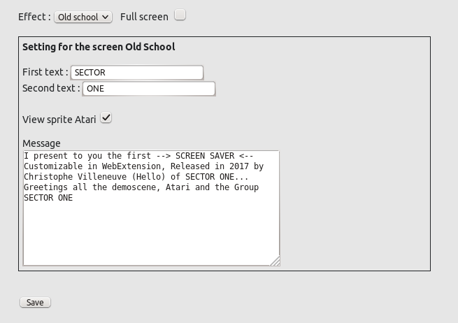
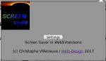
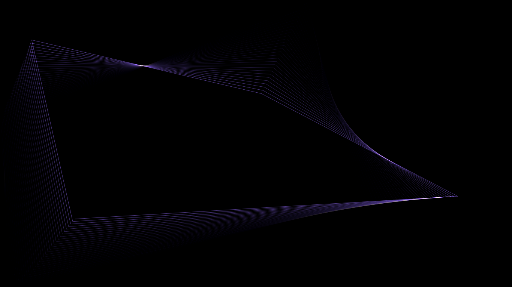
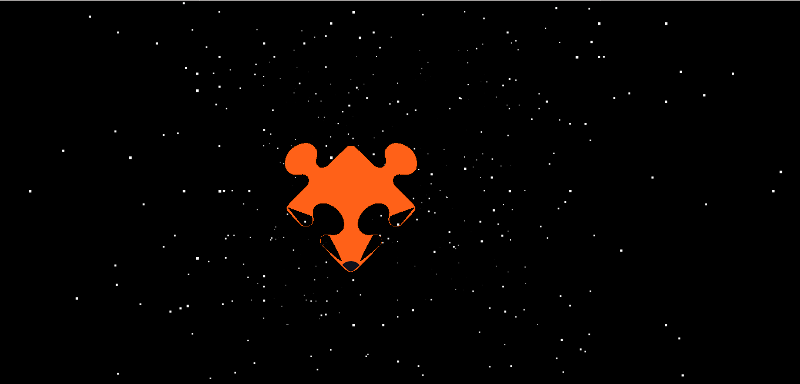
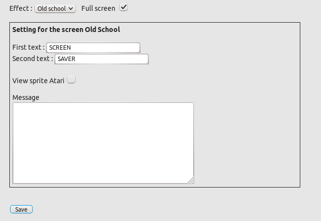
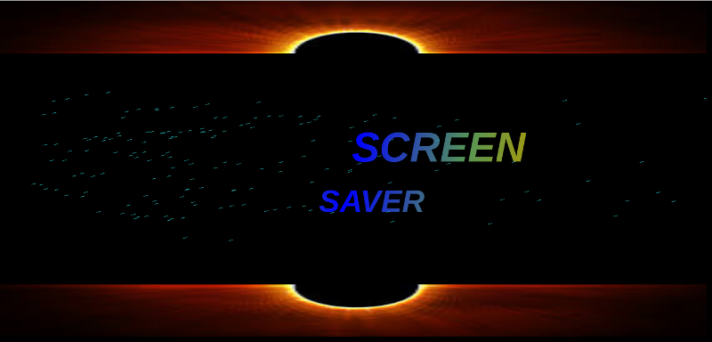

# SreenSaver WebExtensions
## Introduction
L'économiseur d'écran de WebExtensions propose trois différentes animations, inspirées de l’univers de la démoscène et l’une d’elle, vous allez pouvoir la personnaliser à partir de l'écran des paramétrages.

## But
Le but de l’extension est affiché un écran animé à n'importe quel moment, à partir de votre navigateur Firefox sans avoir à verrouiller votre session.

Pour cela, un seul bouton, représenté par une icône,  pour lancer l’animation. Celui-ci se positionne dans la barre d'outils.

Pour choisir une autre animation, vous passerez par l’écran des paramètres.

## L'écran des paramètres
L'écran de configuration se décompose comme ceci : 

### Les effets

L'extension propose 3 animations différentes : 

* Windows 

* Add-ons

* Old school

Le résultat de chaque écran est expliqué un peu plus bas

 
### Fullscreen
Le mode 'Fullscreen' fonctionne pour tous les trois effets ci-dessus. 

Pour voir ce mode, il faut suffit de cocher la case

### Paramétrage de l'écran Old School

L'effet 'old school' offre plusieurs animations paramétrables

Tout d'abord 2 champs textes et sont animés sous la forme de sprite

Une image qui est par défaut affiché, dont vous pourrez cacher en décochant la case

Le champ 'message' permet de taper votre propre texte. il se positionne en bas de l'écran  

## Barre d'adresse avec un popup
Une icône supplémentaire est affichée après quelques secondes sur chaque page.

Quand vous cliquez sur l'icône , vous obtenez un popup  avec quelques informations.   

## Le résultat

Suivant l'effet que vous avez choisi, l'animation affichée sera différente.

### Ecran Windows

Cet écran est inspiré de l'animation disponible sous windows 95 et +, réalisé par Microsoft.

### Ecran Add-ons
Cet écran est un clin d'œil à l'équipe des extensions de Mozilla, que je salue.

### Ecran Old School
Cet écran est pour rappeler que le groupe de démomaker SECTOR ONE est toujours présent et actif depuis sa création à l'époque des ordinateurs ATARI. 

## Ecran personnalisable

L'écran personnalisable permet de modifier les animations de l'effet. 

Ici, nous avons choisi l'effet 'oldschool' avec les paramétrages suivant 

pour obtenir le résultat suivant

## Compatibilité
Pour utiliser cette extension, il faut un navigateur compatible : 

* Firefox 

Compatible avec les versions 57 et +

* Chrome / Chromium

En cours de portage. L'extension sera disponible prochainement

* Opera

En cours de portage. L'extension sera disponible prochainement

* Edge 

En cours de portage. L'extension sera disponible prochainement

## Particuliarité : Fullscreen

Quand vous cochez la case 'fullscreen', l'animation ne se déclange pas automatiquement en mode plein écran. Pour voir l'animation en plein écran, vous tapez sur une touche de votre clavier. 

Toutefois, il est possible de profiter pleinement du plein écran, quand la case 'fullscreen' n'est pas coché en en appuyant sur la touche {F11} de votre clavier suivi de la touche {F5}.

L'exécution automatique de l'effet 'fullscreen' n'est pas supporté avec l'API Fullscreen et dans les permissions des WebExtensions.

## Crédit
(c) Christophe Villeneuve aka Hello / Sector One

Réalisé en 2017

