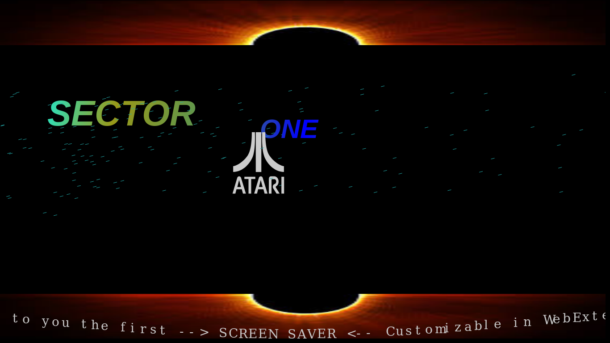

# SreenSaver WebExtensions
## Introduction
L'économiseur d'écran de WebExtensions propose trois différentes animations, inspirées de l’univers de la demoscène et l’une d’elle, vous allez pouvoir là personnaliser à partir de l'écran des paramétrages.

## But
Le but de l’extension permet d’afficher un écran animé à l'importe quel moment, à partir de votre navigateur Firefox sans avoir à verrouiller votre ordinateur.

Pour cela, un seul bouton, représenté par une icône  permet de lancer l’animation

Pour choisir une autre animation, vous passerez par l’écran de paramétrages
 

## L'ecran de paramètres

## Le résultat

Suivant l'effet que vous avez choisir, l'animation affichée sera différente.

### Ecran Windows

Cet écran est inspiré de l'animation disponible sous windows 95 et +, réalisé par Microsoft

### Ecran Add-ons
Cet écran est un clin d'oeil à l'équipe des extensions de Mozilla, dont je salue

### Ecran Old School
Cet écran est pour rappeler que le groupe de démomaker SECTOR ONE est toujours présent et actif depuis sa création à l'époque des ordinateurs ATARI. 

## Ecran personnalisable

## Configuration
Pour utiliser cette extension, il faut un navigateur compatible

### Firefox 
Compatible avec les versions 57 et +

### Chrome / Chromium
En cours de portage. L'extension sera disponible prochainement

### Opera
En cours de portage. L'extension sera disponible prochainement

### Edge 
En cours de portage. L'extension sera disponible prochainement

## Crédit
(c) Christophe Villeneuve aka Hello / Sector One
Réalisé en 2017

