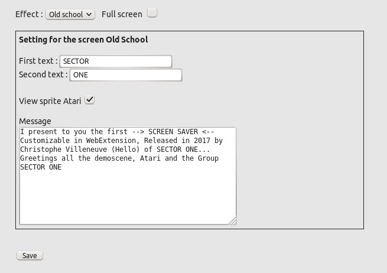
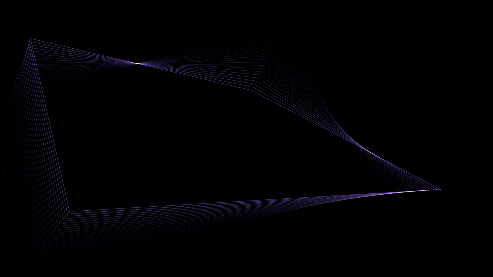

# SreenSaver WebExtensions
## Introduction
L'économiseur d'écran de WebExtensions propose trois différentes animations, inspirées de l’univers de la demoscène et l’une d’elle, vous allez pouvoir là personnaliser à partir de l'écran des paramétrages.

## But
Le but de l’extension permet d’afficher un écran animé à l'importe quel moment, à partir de votre navigateur Firefox sans avoir à verrouiller votre ordinateur.

Pour cela, un seul bouton, représenté par une icône  permet de lancer l’animation

Pour choisir une autre animation, vous passerez par l’écran de paramétrages
 

## L'ecran de paramétrages

## Compatibilité

## Information

## Crédit
(c) Christophe Villeneuve - 2017

