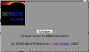
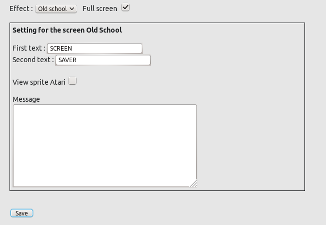
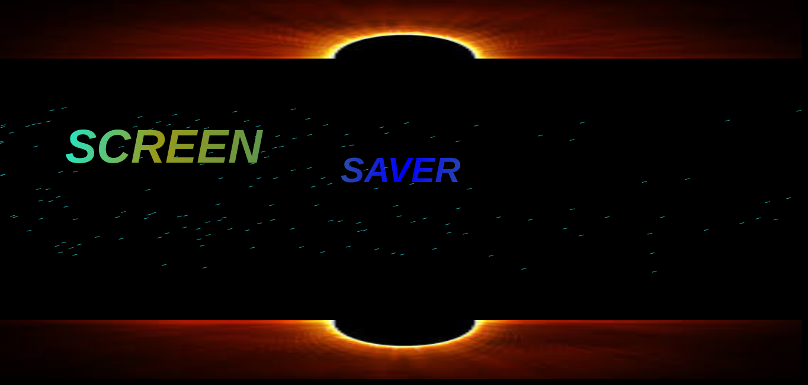

# SreenSaver WebExtensions

Pour lire en Français : <a href='https://github.com/hellosct1/screensaver-webextensions/blob/master/README-FR.md'>cliquez ici</a>

## Introduction

The "Screen Saver WebExtensions" offers three different animations, inspired of the universe demoscene and one of them, you will be able to customize it from the settings screen. 

## Goal

The purpose of the extension is to display an animated screen at any time, from your Firefox browser without having to lock your session.

For this, a single button, represented by an icon,  to launch the animation. It is positioned in the toolbar.

To choose a another animation, you will go through the settings screen.

## The settings screen
The configuration screen breaks down like this:

### The effect

The extension offers 3 different animations:

* Windows 

* Add-ons

* Old school

The result of each screen is explained a little lower

 
### Fullscreen
The mode 'Fullscreen' works for all three effects above. 

To see this mode, just check the box

### Setting the Old School Screen

The 'old school' effect offers several configurable animations

First 2 text fields and are animated in the form of sprite

An image that is displayed by default, which you can hide by unchecking the box

The 'message' field allows you to type your own text. it is positioned at the bottom of the screen

## Address bar with a popup
An additional icon is displayed after a few seconds on each page.

When you click on the icon , you get a popup with some information.   

## The result

Depending on the effect you chose, the displayed animation will be different.

### Windows screen
This screen is inspired by the animation available under Windows 95 and +, made by Microsoft.

### Add-ons screen
This screen is a nod to the Mozilla Extensions team, whom I salute.

### Old School screen
This screen is to remind you that the group of demomaker SECTOR ONE is always present and active since its creation at the time of computers ATARI.

## Customizable screen

The customizable screen allows you to modify the animations of the effect.

Here, we chose the 'oldschool' effect with the following settings

to get the next result

## Compatibility
To use this extension, you need a compatible browser:

* Firefox 

Compatible with the version 57 and +

* Chrome / Chromium

In porting. The extension will be available soon

* Opera

In porting. The extension will be available soon

* Edge 

In porting. The extension will be available soon

## Feature : Fullscreen

When you check the 'fullscreen' box, the animation does not automatically switch to full screen mode. To see the animation in full screen, you tap a key on your keyboard.

However, it is possible to fully enjoy the full screen, when the 'fullscreen' box is not checked by pressing the {F11} key on your keyboard followed by the {F5} key.

The automatic execution of the 'fullscreen' effect is not supported with the Fullscreen API and in the WebExtensions permissions.

## Credit
(c) Christophe Villeneuve aka Hello / Sector One

Released in 2017

